# 使用 MMRotate 和 Label-Studio 进行半自动化目标检测标注

标注数据是一个费时费力的任务，本文介绍了如何使用 MMRotate 中的 RTMDet-R 算法联合 Label-Studio 软件进行半自动化标注。具体来说，使用 RTMDet-R 预测图片生成标注，然后使用 Label-Studio 进行微调标注，社区用户可以参考此流程和方法，将其应用到其他领域。

- RTMDet-R：RTMDet-R 是 OpenMMLab 自研的高精度单阶段的目标检测算法，开源于 MMRotate 旋转目标检测工具箱中，其开源协议为 Apache 2.0，工业界的用户可以不受限的免费使用。
- [Label Studio](https://github.com/heartexlabs/label-studio) 是一款优秀的标注软件，覆盖图像分类、目标检测、分割等领域数据集标注的功能。

本文将使用[DOTA数据集](https://captain-whu.github.io/DOTA/index.html)的图片，进行半自动化标注。

## 环境配置

首先需要创建一个虚拟环境，然后安装 PyTorch 和 MMCV。在本文中，我们将指定 PyTorch 和 MMCV 的版本。接下来安装 MMDetection、MMRotate、Label-Studio 和 label-studio-ml-backend，具体步骤如下：

创建虚拟环境：

```shell
conda create -n rtmdet python=3.9 -y
conda activate rtmdet
```

安装 PyTorch

```shell
# Linux and Windows CPU only
pip install torch==1.10.1+cpu torchvision==0.11.2+cpu torchaudio==0.10.1 -f https://download.pytorch.org/whl/cpu/torch_stable.html
# Linux and Windows CUDA 11.3
pip install torch==1.10.1+cu113 torchvision==0.11.2+cu113 torchaudio==0.10.1 -f https://download.pytorch.org/whl/cu113/torch_stable.html
# OSX
pip install torch==1.10.1 torchvision==0.11.2 torchaudio==0.10.1
```

安装 MMCV

```shell
pip install -U openmim
mim install "mmcv>=2.0.0rc0"
# 安装 mmcv 的过程中会自动安装 mmengine
```

安装 MMDetection

```shell
git clone https://github.com/open-mmlab/mmdetection -b dev-3.x
cd mmdetection
pip install -v -e .
```

安装 MMRotate

```shell
git clone https://github.com/open-mmlab/mmrotate/ -b dev-1.x
cd mmrotate
pip install -v -e .
```

安装 Label-Studio 和 label-studio-ml-backend

```shell
# 安装 label-studio 需要一段时间,如果找不到版本请使用官方源
pip install label-studio==1.7.2
pip install label-studio-ml==1.0.9
```

下载 RTMDet-R 权重

```shell
cd path/to/mmrotate
mkdir work_dirs
cd work_dirs
wget https://download.openmmlab.com/mmrotate/v1.0/rotated_rtmdet/rotated_rtmdet_m-3x-dota/rotated_rtmdet_m-3x-dota-beeadda6.pth
```

## 启动服务

启动 RTMDet-R 后端推理服务：

```shell
cd path/to/mmrotate
label-studio-ml start projects/LabelStudio/backend_template --with \
config_file=configs/rotated_rtmdet/rotated_rtmdet_m-3x-dota.py \
checkpoint_file=./work_dirs/rotated_rtmdet_m-3x-dota-beeadda6.pth \
device=cpu \
--port 8003
# device=cpu 为使用 CPU 推理，如果使用 GPU 推理，将 cpu 替换为 cuda:0
```

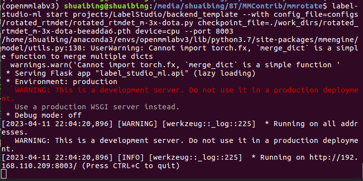

此时，RTMDet-R 后端推理服务已经启动，后续在 Label-Studio Web 系统中配置 http://localhost:8003 后端推理服务即可。

现在启动 Label-Studio 网页服务：

```shell
label-studio start
```

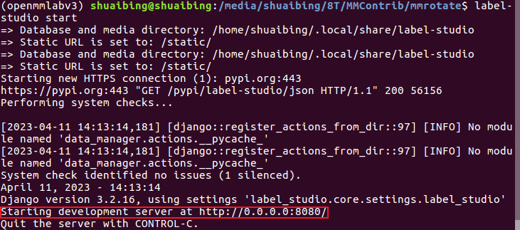

打开浏览器访问 [http://localhost:8080/](http://localhost:8080/) 即可看到 Label-Studio 的界面。

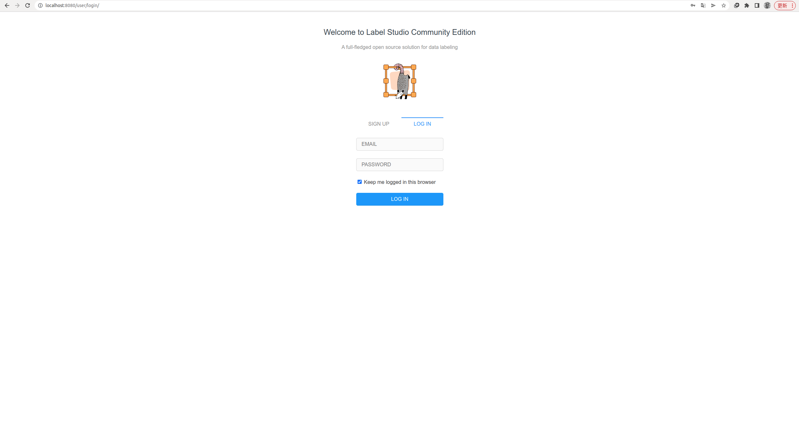

我们注册一个用户，然后创建一个 RTMDet-R-Semiautomatic-Label 项目。

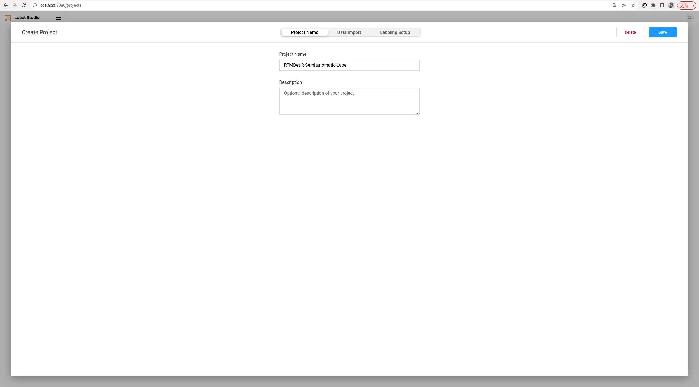

我们按照 [MMRotate Preparing DOTA Dataset](https://github.com/open-mmlab/mmrotate/blob/main/tools/data/dota/README.md) 下载好示例的DOTA图片，点击 Data Import 导入需要标注的图片。

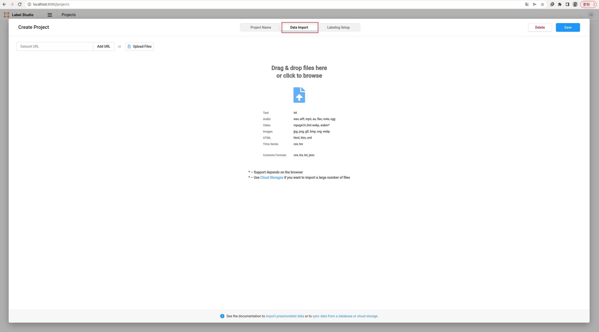


然后选择 Object Detection With Bounding Boxes 模板。

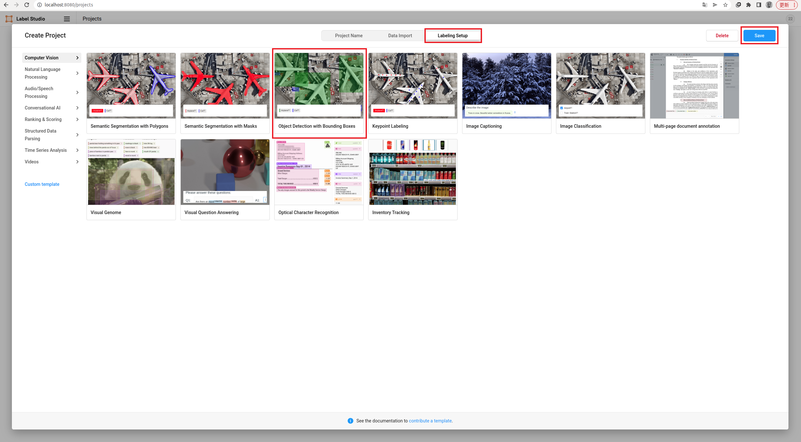

```shell
plane
ship
storage-tank
baseball-diamond
tennis-court
basketball-court
ground-track-field
harbor
bridge
large-vehicle
small-vehicle
helicopter
roundabout
soccer-ball-field
swimming-pool
```

然后将上述类别复制添加到 Label-Studio，然后点击 Save。


然后在设置中点击 Add Model 添加 RTMDet-R 后端推理服务。

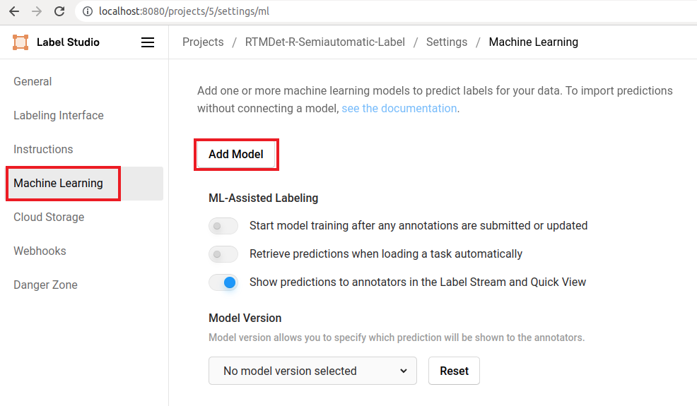

点击 Validate and Save，然后点击 Start Labeling。

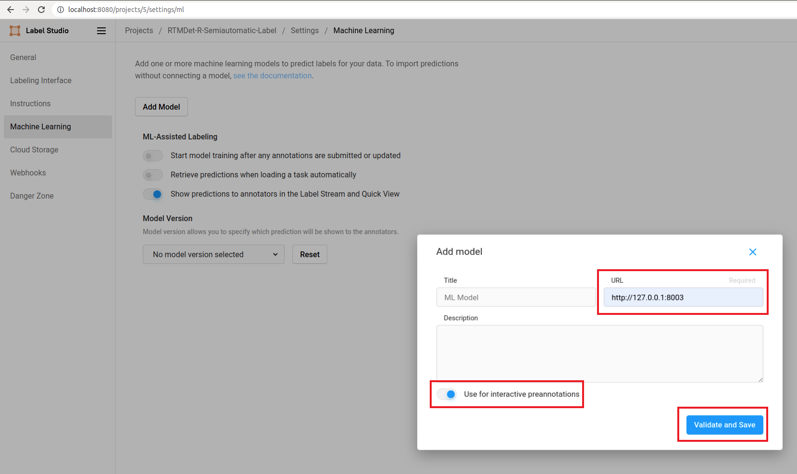

看到如下 Connected 就说明后端推理服务添加成功。

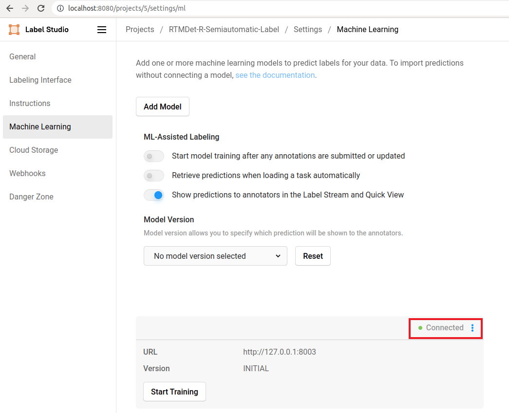

## 开始半自动化标注

点击 Label 开始标注


我们可以看到 RTMDet-R 后端推理服务已经成功返回了预测结果并显示在图片上，我们可以发现存在一些漏检的情况。

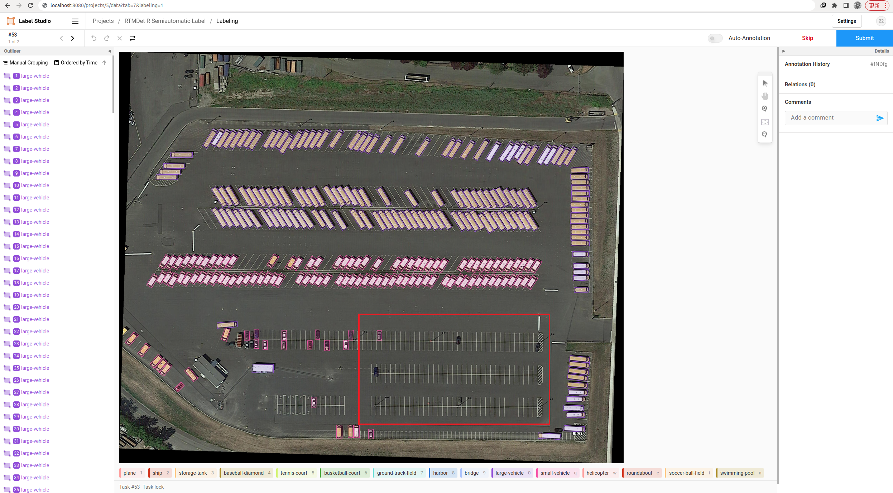

我们手工添加一些标注框，并修正一下框的位置，得到以下修正过后的标注，然后点击 Submit，本张图片就标注完毕了。


我们 submit 完毕所有图片后，点击 export 导出 COCO 格式的数据集，就能把标注好的数据集的压缩包导出来了。

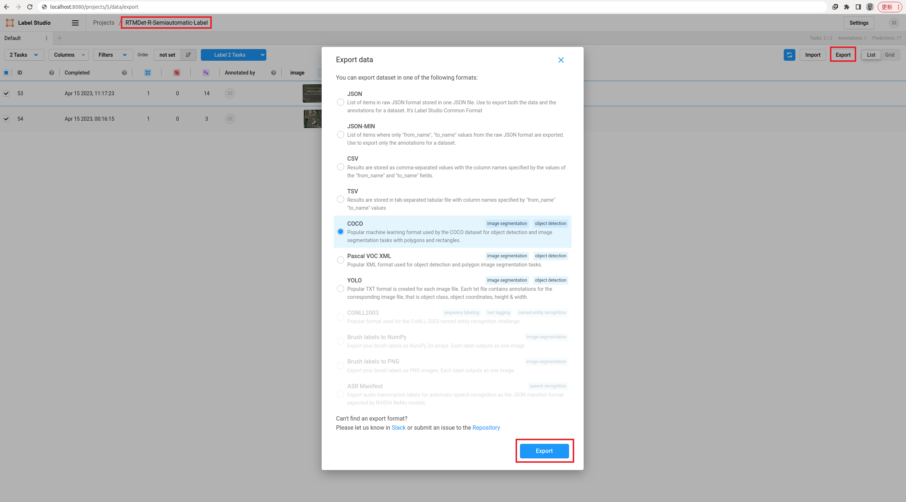

用 VSCode 打开解压后的文件夹，可以看到标注好的数据集，包含了图片和 json 格式的标注文件。


到此半自动化标注就完成了，我们可以用这个数据集在 MMRotate 训练精度更高的模型了，训练出更好的模型，然后再用这个模型继续半自动化标注新采集的图片，这样就可以不断迭代，扩充高质量数据集，提高模型的精度。
